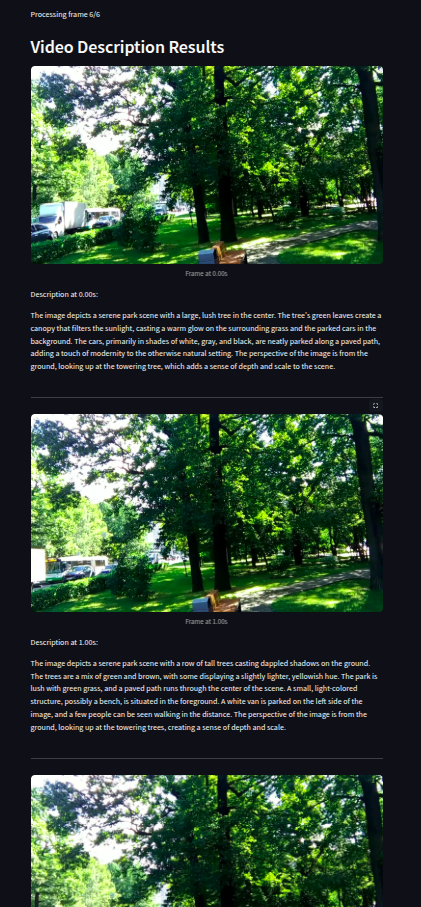

# Visual Language Model (VLM) Testing with Moondream AI 0.5

## What is a Visual Language Model (VLM)?

A **Visual Language Model (VLM)** is an AI system designed to process and understand both images and text. It combines computer vision and natural language processing (NLP) to analyze visual content and generate meaningful descriptions, answers, and detections. VLMs can be used for a variety of applications, including object detection, image captioning, and scene understanding.

## VLM in Moondream AI 0.5

Moondream AI 0.5 is a powerful Visual Language Model that enables advanced image and video analysis. It integrates with Streamlit for an interactive user interface, allowing users to perform tasks such as:

- **General Image Description**: Generates a detailed description of the contents of an image.
- **Custom Question Answering**: Answers specific questions about an uploaded image.
- **Point and Object Detection**: Identifies objects and returns their coordinates for further processing.
- **Video Frame Analysis**: Processes video files, extracts frames, and applies VLM-based understanding.

## Implementation Details

### Object Detection with Moondream AI

The object detection functionality in Moondream AI 0.5 allows users to identify objects within an image and overlay bounding boxes around detected items. The detection pipeline follows these steps:

1. **Image Encoding**: The uploaded image is converted into a format suitable for Moondream's API.
2. **Detection API Call**: The model processes the image and returns object coordinates.
3. **Bounding Box Drawing**: The system overlays a rectangle on the image using OpenCV.
4. **Result Display**: The processed image is displayed in the Streamlit UI.

### Video Processing

The system can process video files by extracting frames at set intervals and analyzing them using Moondream AI. The workflow includes:

1. **Frame Extraction**: Frames are extracted based on user-defined intervals.
2. **VLM Analysis**: Each frame is sent to Moondream AI for interpretation.
3. **Captioning**: The model provides descriptions or detected objects for each frame.
4. **Output Generation**: Results are displayed in the UI and optionally saved as a subtitle (SRT) file.

### Streamlit UI

The interface is built using **Streamlit**, providing an easy-to-use web app for image and video analysis. Users can:
- Upload images and videos.
- Select analysis modes (description, object detection, question answering).
- View processed images with bounding boxes.
- Generate captions for video frames.

## Screenshots

### Streamlit UI Interface

## Future Enhancements

- Implement real-time video processing.
- Improve detection accuracy with model fine-tuning.
- Integrate additional VLM models for comparison.

Moondream AI 0.5 provides a powerful platform for VLM-based visual understanding, making it suitable for research and practical applications in AI-driven image analysis.

